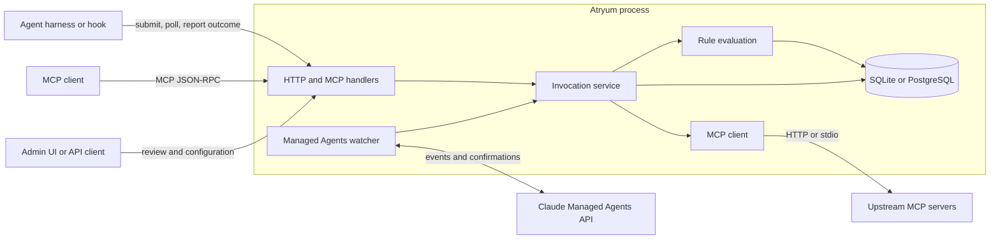
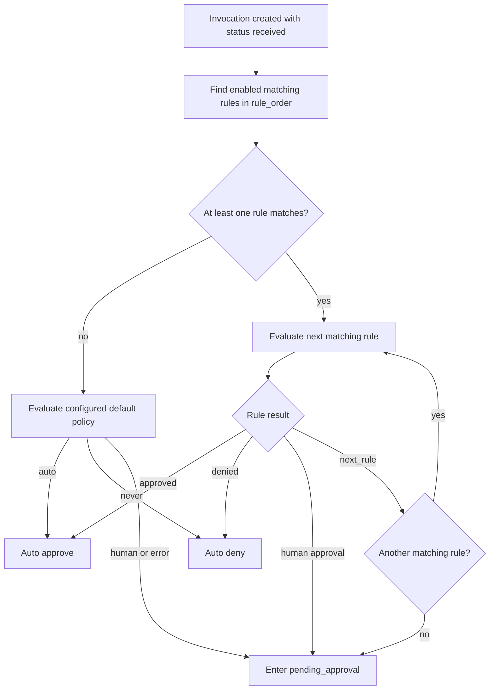
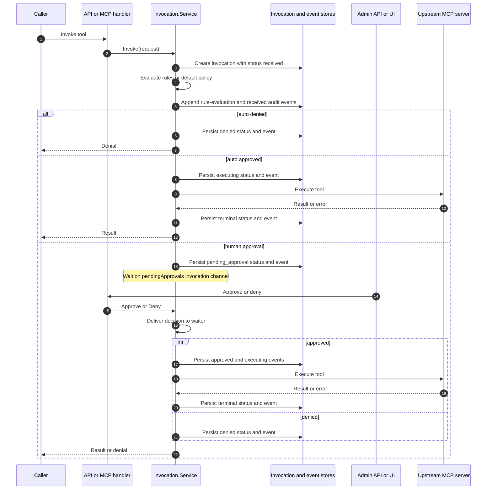
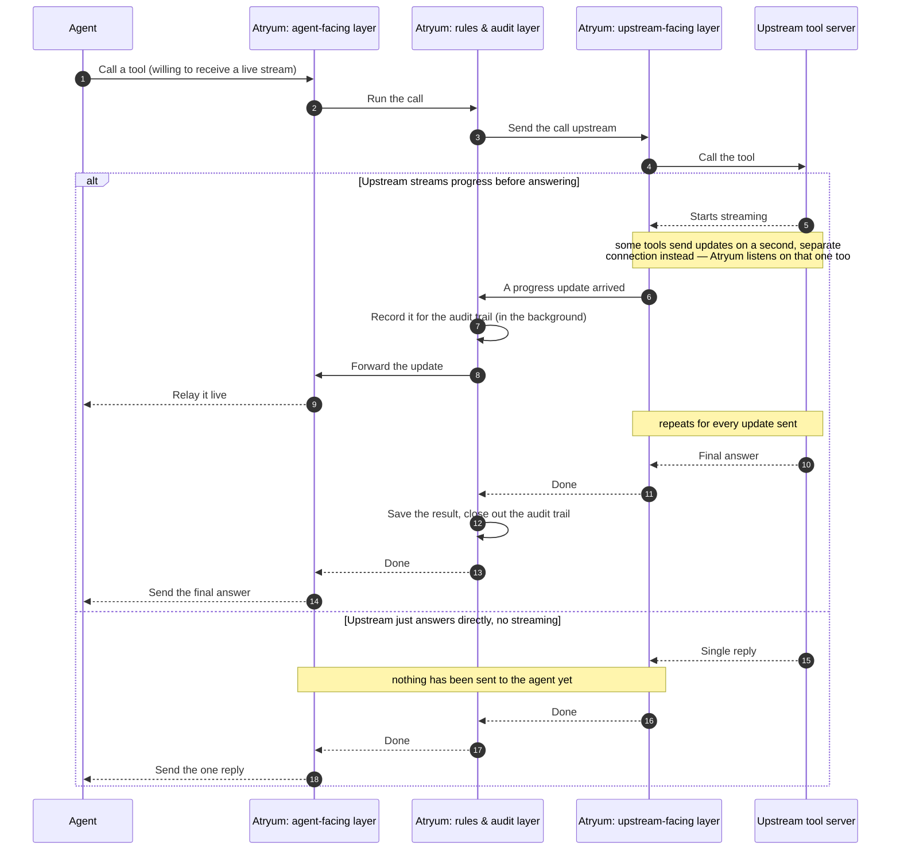
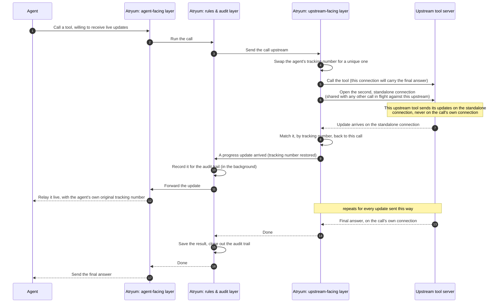
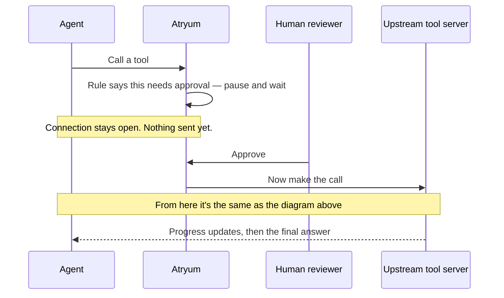
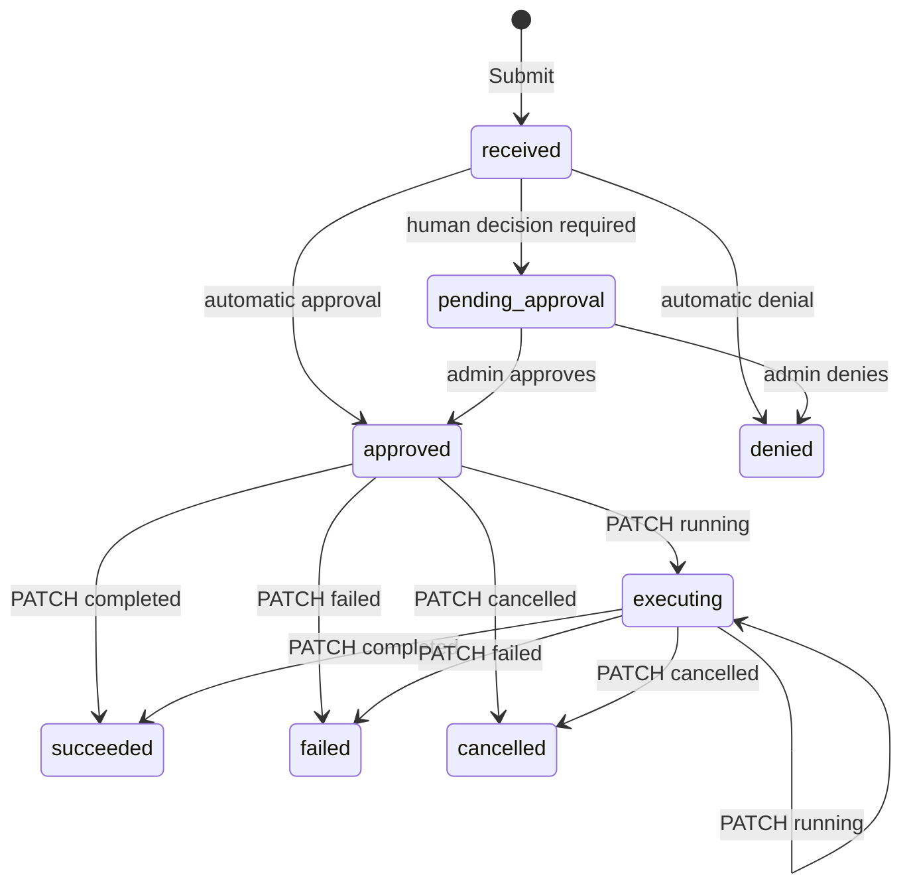
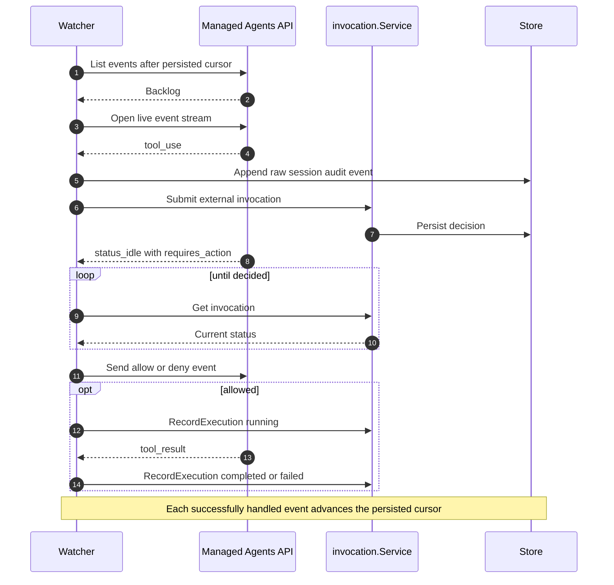

# Atryum architecture

This document describes Atryum's internal boundaries, control flow, and durable state.
For installation, configuration examples, endpoint details, and operator workflows, see
the [README](../README.md).

## System context

Atryum is a Go service that mediates tool calls. It exposes runtime endpoints to agent
harnesses, an MCP-compatible proxy, and an admin API/UI. All ingress paths share the
same invocation service, rule evaluation, and audit store.



The diagram corresponds to `internal/api`, `internal/managedagents`,
`internal/invocation`, `internal/store`, and `internal/mcp`.

## Runtime ingress

The entry path determines who executes an approved tool. It does not change how rules
or audit records are evaluated.

| Path | Service operation | Executor | Completion source |
|---|---|---|---|
| Pre-tool hook: `POST /api/v1/external/invocations` | `Submit` | Calling harness | Harness reports through `PATCH /api/v1/external/invocations/{id}` |
| MCP proxy: `tools/call` on `/mcp/{server}` | `Invoke` | Atryum | Atryum records the upstream MCP result |
| Direct invocation: `POST /api/v1/invocations` | `Invoke` | Atryum | Atryum records the upstream MCP result |
| Managed Agents bridge | `Submit` and `RecordExecution` | Anthropic runtime | Watcher maps Anthropic events to invocation updates |

`Submit` intentionally leaves `upstream_name` empty because it makes a decision only.
`Invoke` resolves a configured MCP server before evaluating and executing the call.

## Component boundaries

| Package | Responsibility | Must not own |
|---|---|---|
| `internal/api` | HTTP/MCP transport, authentication middleware, request/response mapping, embedded UI | Rule or invocation state transitions |
| `internal/invocation` | Invocation lifecycle, rule matching, AI evaluation dispatch, approval coordination | SQL or upstream transport details |
| `internal/store` | SQLite/PostgreSQL repositories, schema migrations, durable query semantics | Policy decisions |
| `internal/mcp` | Server resolution, MCP forwarding, upstream authentication and OAuth | Approval policy |
| `internal/auth` | Inbound OIDC/JWT validation and authenticated identity context | Upstream MCP credentials |
| `internal/managedagents` | Anthropic session discovery, event replay, confirmation delivery | Independent rule evaluation |

The React application in `ui/` is compiled into `internal/api/web/` for the production
binary. During development it can run separately, but it still uses the same admin API.

## Decision pipeline

Rules are loaded in ascending `rule_order`. Matching uses server/source, tool, and the
resolved local agent record. A local agent record is derived from the authenticated
runtime identity; on the no-auth external path, the submitted `agent_id` is used.



`next_rule` is produced only by `ai_evaluation`. If every matching AI rule defers,
Atryum falls back to human approval. The global policy provider is used only when no
rule matches; it is not evaluated after a matching rule defers.

An `ai_evaluation` rule selects one configured evaluator. Standalone deployments use
a local LLM configuration stored in `llm_configs`. Evaluation errors escalate to human
review; missing charter context denies; and an unknown verdict is treated as
`next_rule`, eventually reaching human review if no later rule decides.

## Atryum-executed calls

`Invoke` owns the complete execution lifecycle. A human-gated HTTP request remains
blocked on an in-memory channel until an admin decision or until the caller's request
context is cancelled (a client disconnect or a client-side timeout). Atryum imposes no
approval deadline of its own: the configured `request_timeout_seconds` bounds upstream
tool execution, not the human wait. The durable invocation is still visible while the
request is blocked.

Human-approval coordination for Atryum-executed calls is process-local. PostgreSQL
persists the invocation but does not provide distributed signaling for the in-memory
waiter (the blocked request goroutine), so these calls require a single active Atryum
process. Concretely:

- With multiple replicas, an approval handled by a different process updates the row
  without waking the original request; when that request's context is later cancelled,
  it overwrites the approved state as failed.
- Caller cancellation marks the invocation failed. The stored error text says
  "cancelled", but the persisted status is `failed`, not `cancelled`.
- An abrupt process exit drops the waiter and caller while the durable invocation can
  remain `pending_approval`. Nothing resumes pending invocations at startup, so a
  later approval updates that row but does not execute the tool.

Multi-replica or crash-resumable execution requires durable coordination — for
example a work queue, or an outbox table that a worker drains — which is not
implemented.



The admin invocation stream is a polling SSE view: the handler queries the durable
invocation list every two seconds and emits when its signature changes. Database writes
do not directly publish to the stream.

### Live SSE relay for tools/call

This section is a special case of the execution flow above, scoped to just one of the
two `Invoke`-backed entry points from the Runtime ingress table: the MCP proxy's
`tools/call`. Direct invocation (`POST /api/v1/invocations`) is a plain REST endpoint —
it does not negotiate `Accept: text/event-stream` and never streams.

**Background, read this first.** Every message in this protocol is JSON-RPC: a
*request* asks for something and carries an `id`; a *response* answers one specific
request by carrying that same `id` back; a *notification* is a one-way heads-up with no
`id` and no reply expected. Server-Sent Events (SSE) is just a way to send several of
these messages down one HTTP connection over time — as `data:` lines, one message each,
separated by blank lines — instead of sending one message all at once. A tool call
answered this way might look like:

```
data: {"jsonrpc":"2.0","method":"notifications/progress","params":{"progress":1,"total":3}}

data: {"jsonrpc":"2.0","id":"1","result":{"content":[{"type":"text","text":"done"}]}}
```

The first line is a notification — a progress update nobody has to reply to. The second
is the real answer (it has an `id` and a `result`). This doc calls that second one the
**terminal response**: it's the one and only thing a non-streaming call would have
returned.

**What Atryum does with this.** If the upstream tool streams progress notifications
while working on a call, Atryum forwards each one to the agent as it happens — the agent
sees them live instead of waiting in silence until the call finishes.

If the upstream tool answers with a single plain response and no streaming, the agent
simply receives that response. There are no live updates to relay in that case.

**Some upstream tools use a second, separate connection for progress updates instead of
the one above.** The wire protocol actually allows two different channels for anything a
tool sends before its final answer: updates riding along on the same connection as the
call itself (the channel described above), and a second, independent connection carrying
updates that aren't tied to any one specific call. Some widely-used tool-building
frameworks always use this second channel for progress updates rather than the first.
Atryum listens on both, so it makes no difference which channel a given upstream tool
happens to prefer — the agent sees the same live updates either way.

**Because that second channel isn't tied to any one call, Atryum has to work out whose
update belongs to whom.** Several agents can have calls in flight against the same
upstream tool server at once, all sharing that one second channel. Each update on it
carries a tracking number the calling agent chose — but two unrelated agents could easily
pick the same tracking number, since neither knows about the other. Atryum doesn't know in
advance which of the two channels a given upstream will actually use to answer, so for
every call that asks for update tracking it swaps in its own guaranteed-unique tracking
number in place of whatever the agent supplied, before the call ever goes upstream — not
only for calls that end up using the second channel. It restores the agent's own original
number before handing an update back, the same way no matter which of the two channels
that update actually arrives on. That's what makes a coincidental match between two
unrelated agents' tracking numbers harmless either way. An update on the second channel
with no tracking number at all (a plain log-style message, say) is only ever handed to an
agent when exactly one call is currently sharing that channel; with more than one, there's
no way to know whose it is, and Atryum drops it rather than guess wrong.

**The three layers involved**, in order: the part of Atryum facing the agent decides
whether to relay live and writes the response back; the part in the middle runs
approval rules and keeps the audit trail; the part facing the upstream tool speaks the
actual wire protocol and hands messages up as they arrive. (If you want to find the
code: `internal/api` → `internal/invocation` → `internal/mcp`, in that order.)



The diagram above shows updates arriving on the same connection as the call itself —
the most common case, and the only one some upstream tools use at all. Here's what
happens instead when an upstream tool sends its updates on the second, standalone
connection described earlier:



**Approval gating applies before any streaming can start.** If a rule says a tool call
needs a human to approve it first, Atryum pauses *before ever contacting the upstream
tool* — which is before any streaming could even start. Nothing is sent to the agent
while a call is waiting on approval, whether or not the agent asked for a live stream.



**Every relayed update is also recorded for the audit trail**, in the background, so a
slow database write can never delay a live update reaching the agent or eat into the
time budget described below.

**Why there are three separate time limits, not one.** A normal (non-streaming) call has
one clock: if it takes too long overall, Atryum gives up. A streaming call can't work
that way, because "this is taking a while" is expected and fine as long as *something*
keeps happening. So there are three limits instead of one:

- How long to wait for the upstream tool to even start responding.
- How long to wait between one update and the next, once it has started — this one
  resets every time something new arrives, so a stream that's still actively sending
  updates is never punished just for running long overall.
- A hard ceiling on the whole call, just in case, so nothing runs forever.

Whichever limit is hit first ends the call, and Atryum records *which one* (a stalled
tool, an agent that disconnected, and an ordinary network failure all get a different,
searchable label in the audit trail) — so whoever's debugging later doesn't have to
guess which of the three actually happened.

**The agent's own connection has a time limit too.** If the agent stops reading — its
connection dies, or it just stops paying attention — Atryum needs to notice, otherwise
it would sit forever trying to hand off data nobody is receiving, which would also
stall the upstream tool call waiting behind it. So every write to the agent has its own
short time limit, and while the upstream tool is quiet, Atryum sends small "still here"
pings on the open connection, so ordinary network equipment sitting in between doesn't
mistake a slow-but-healthy call for a dead one and close it.

**If the upstream tool's own connection drops mid-stream, Atryum reconnects and picks up
where it left off** — this is a feature of the underlying protocol, not something Atryum
invented — so the agent doesn't see a glitch. The connection *from* Atryum *to* the
agent intentionally does not support this kind of resume: promising it would mean
promising to remember exactly where every agent left off, even across an Atryum
restart, which isn't a promise Atryum makes today.

Atryum does not forward messages that the *upstream tool* might try to send back toward
the agent as if it were the agent's own message (a few advanced, rarely-used parts of
the protocol allow this) — those get recorded for the audit trail and dropped, since
Atryum has no way to get a reply back to where it came from. The always-on keepalive
connection agents can poll separately is a distinct mechanism from this relay.

A single on/off switch lets an operator disable the relay entirely, so every `tools/call`
gets a single buffered response regardless of what the agent or upstream would otherwise
support.

#### Edge cases and failure paths

- **A tool call that failed to connect properly must not get relayed twice.** If Atryum
  needs to retry the setup for a call, it only does so before anything has been sent to
  the agent — retrying after the agent has already seen live updates would relay
  everything a second time, so Atryum refuses to retry once that's happened.
- **Something going wrong mid-stream must still leave the agent with a real answer.**
  Even if a problem is discovered after Atryum has already started relaying updates, the
  agent still gets a proper closing message explaining what happened — never a
  connection that just quietly closes with no explanation.
- **A duplicate update on reconnect must not reach the agent twice.** When Atryum
  reconnects to an upstream tool mid-stream, some tools resend the very last update as
  part of "catching up." Atryum recognizes and skips that one repeated update, so the
  agent only ever sees it once.
- **An update that spans multiple lines must not get corrupted.** The wire format allows
  a single update to be written across more than one line. Atryum preserves that shape
  correctly when relaying it, instead of accidentally squashing it into something that
  looks like a different, malformed message.
- **A stuck external tool process must be fully stopped, not half-stopped, when it times
  out.** Some upstream tools run as an external program that can itself launch further
  child programs. If Atryum only stopped the program it directly started, a leftover
  child process could keep running and keep things open, and the timeout would never
  actually free anything up. Atryum stops the whole group of processes together.
- **Resetting a "how long has it been quiet" timer must not accidentally end a call
  that's actually fine.** Naively restarting a countdown every time an update arrives
  can, in rare bad timing, let the old countdown finish a split second before the
  restart takes effect — ending a call that was actually still healthy. Atryum
  double-checks how much time has *really* passed before deciding to end a call, so a
  well-timed update can never be wrongly punished by bad luck in the timing.
- **Two agents that happen to pick the same tracking number for their updates must
  never get mixed up.** The second, standalone update channel described above is shared
  across every call currently in flight against a given upstream tool server, and
  agents don't know about each other's choices. Since Atryum can't tell in advance which
  channel a given upstream will actually use to answer, it assigns its own
  guaranteed-unique tracking number to *every* call that asks for update tracking, not
  only ones that end up using the second channel, and restores the agent's original
  number the same way regardless of which channel the update comes back on — so a
  coincidental match can never cross-deliver one agent's update to another either way.
- **An upstream tool that doesn't support the second, standalone channel at all doesn't
  affect the call itself.** Some tool servers simply don't offer it. Atryum notices on
  the first attempt and stops trying again for the rest of that session, but the actual
  tool call still completes and answers normally either way — the only thing lost is any
  update that server would have sent exclusively on that unsupported channel.

## Decision-only calls

`Submit` persists and returns a decision without contacting an MCP server. An external
executor polls a pending invocation, runs the tool only after approval, and reports its
execution state.



The state diagram shows the supported caller contract, not enforced transitions.
`RecordExecution` currently validates only the transition to `running`; the terminal
reports (`completed`, `failed`, `cancelled`) are applied without checking the prior
status, so callers must not report a terminal outcome before approval. When inbound auth supplies an agent identity, the service also checks that
the invocation belongs to that agent. In no-auth mode, ownership cannot be verified.

## Managed Agents bridge

Each configured account can run watchers for linked Anthropic sessions. A watcher
replays events from its persisted cursor, follows the live SSE stream, and reconnects
after failures. Tool calls still use `Submit`, so this bridge does not introduce a
second policy engine.



Tool-use submission is idempotent across replay because the Anthropic event ID is used
as the invocation idempotency key. Cursor advancement waits until the event handler has
completed successfully enough to avoid skipping a confirmation that must be retried.

## Durable model

The core tables are:

| Table | Architectural role |
|---|---|
| `invocations` | Current state and request/result material for each governed call |
| `invocation_events` | Ordered, best-effort event history for an invocation |
| `approval_rules` | Ordered match criteria and decision action |
| `agents` | Mapping from runtime identities to named governance records |
| `mcp_servers` | Runtime upstream definitions and connection state |
| `oauth_credentials` and `oauth_connect_sessions` | Upstream OAuth credentials and browser-flow state |
| `llm_configs` | Local AI-evaluation providers |
| `managed_agent_bindings`, `managed_agent_sessions` | Anthropic agent/session ownership and replay state |
| `external_sessions` | Atryum-minted harness sessions linking external invocations for cross-call evaluation context |

Schema changes are ordered migrations under `internal/store/migrations/` and are
applied at startup for both SQLite and PostgreSQL.

An invocation's row is the authoritative record of current state;
`invocation_events` is best-effort event history. The two writes are separate
statements, not one transaction, so parity can fail in either direction: a status
update can commit while its event append fails, and — where code appends the event
before updating the row — an event can exist for a status update that never
committed. Event-append errors are currently discarded without a log line. Code that
adds a transition must attempt to update both representations, but consumers must not
reconstruct current state solely from events or assume complete parity. Deployments
that require a transactionally complete compliance audit need to wrap both writes in
one transaction (or adopt an outbox design) before treating the event history as
such.

## Configuration and ownership

`atryum.toml` owns process bootstrap concerns: listening, database selection, inbound
auth, optional external service credentials, default policy, and initial upstreams.
After the first successful bootstrap, MCP server definitions, rules, agents, evaluator
settings, and connection state are database-owned and managed through the admin API.

This separation prevents runtime changes from being overwritten by a restart. In
particular, `[[upstreams]]` seeds an empty `mcp_servers` table; it is not continuous
configuration reconciliation.

## Authentication boundaries

Inbound and upstream authentication are separate trust boundaries:

- Agent runtime auth validates bearer tokens and places the configured agent identity
  claim in request context. The invocation service uses that trusted identity for rule
  targeting and ownership checks.
- Admin auth protects the UI and admin API when an auth provider has
  `admin_enabled = true` and the configured admin claim is present.
- Upstream MCP authentication is owned by `internal/mcp/auth_provider`; credentials and
  OAuth tokens are never returned to the agent caller.
- No-auth mode is a local deployment option. Identity supplied by a caller in this mode
  is attribution, not a cryptographic ownership guarantee.
