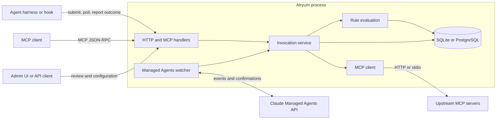
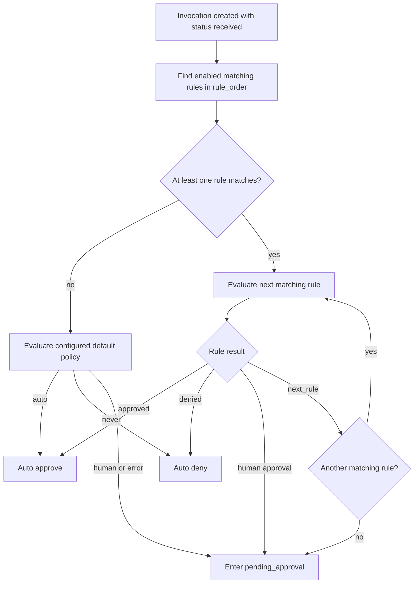
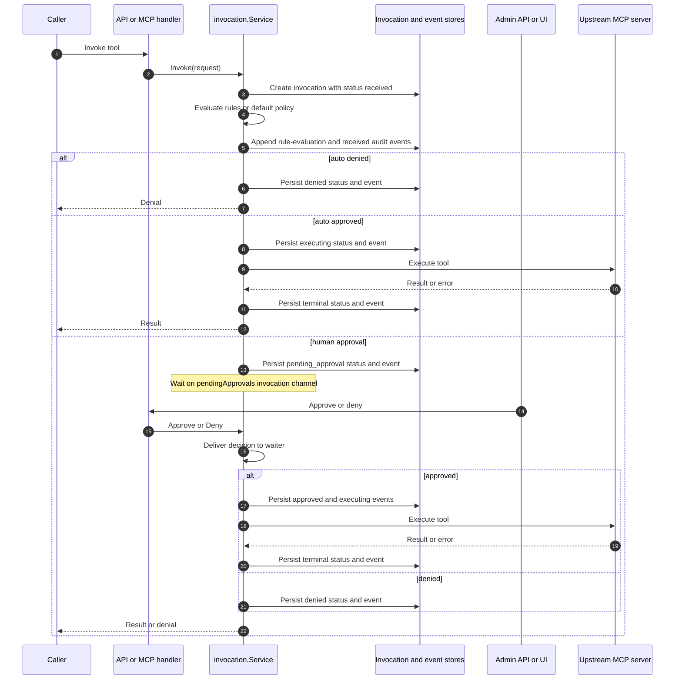
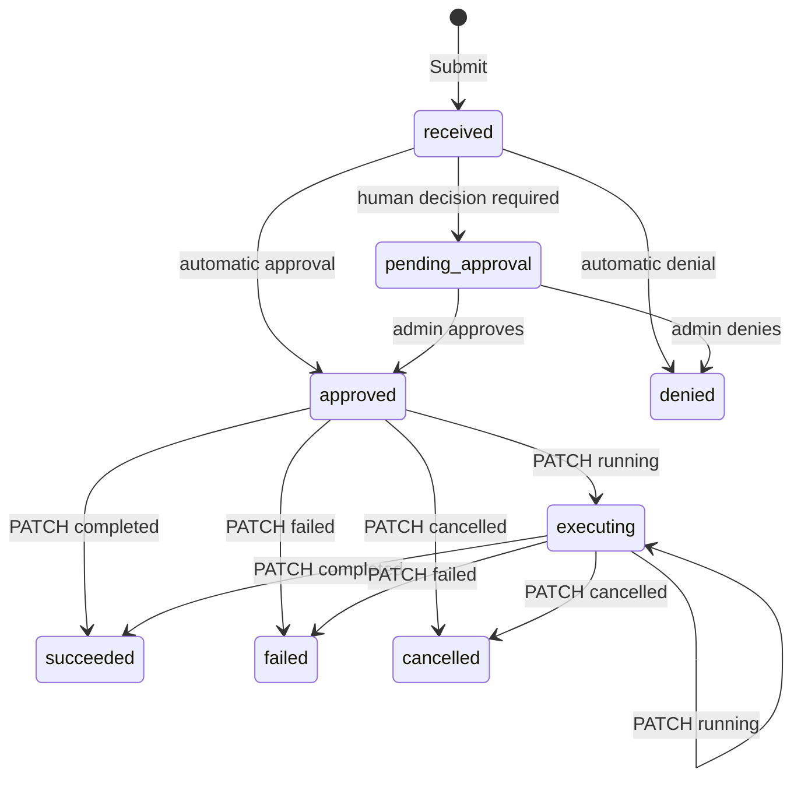
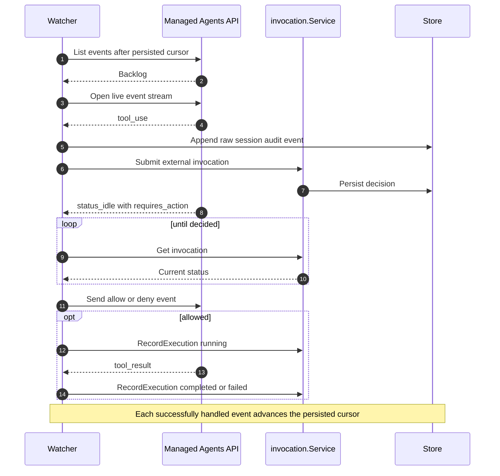

# Atryum architecture

This document describes Atryum's internal boundaries, control flow, and durable state.
For installation, configuration examples, endpoint details, and operator workflows, see
the [README](../README.md). The optional ValidMind platform connection is documented
separately in [ValidMind integration](validmind-integration-flow.md).

## System context

Atryum is a Go service that mediates tool calls. It exposes runtime endpoints to agent
harnesses, an MCP-compatible proxy, and an admin API/UI. All ingress paths share the
same invocation service, rule evaluation, and audit store.

The diagram corresponds to `internal/api`, `internal/managedagents`,
`internal/invocation`, `internal/store`, and `internal/mcp`.

## Runtime ingress

The entry path determines who executes an approved tool. It does not change how rules
or audit records are evaluated.

| Path | Service operation | Executor | Completion source |
|---|---|---|---|
| Pre-tool hook: `POST /api/v1/external/invocations` | `Submit` | Calling harness | Harness reports through `PATCH /api/v1/external/invocations/{id}` |
| MCP proxy: `tools/call` on `/mcp/{server}` | `Invoke` | Atryum | Atryum records the upstream MCP result |
| Direct invocation: `POST /api/v1/invocations` | `Invoke` | Atryum | Atryum records the upstream MCP result |
| Managed Agents bridge | `Submit` and `RecordExecution` | Anthropic runtime | Watcher maps Anthropic events to invocation updates |

`Submit` intentionally leaves `upstream_name` empty because it makes a decision only.
`Invoke` resolves a configured MCP server before evaluating and executing the call.

## Component boundaries

| Package | Responsibility | Must not own |
|---|---|---|
| `internal/api` | HTTP/MCP transport, authentication middleware, request/response mapping, embedded UI | Rule or invocation state transitions |
| `internal/invocation` | Invocation lifecycle, rule matching, AI evaluation dispatch, approval coordination | SQL or upstream transport details |
| `internal/store` | SQLite/PostgreSQL repositories, schema migrations, durable query semantics | Policy decisions |
| `internal/mcp` | Server resolution, MCP forwarding, upstream authentication and OAuth | Approval policy |
| `internal/auth` | Inbound OIDC/JWT validation and authenticated identity context | Upstream MCP credentials |
| `internal/managedagents` | Anthropic session discovery, event replay, confirmation delivery | Independent rule evaluation |
| `internal/backend` | Optional ValidMind backend client | Core standalone behavior |

The React application in `ui/` is compiled into `internal/api/web/` for the production
binary. During development it can run separately, but it still uses the same admin API.

## Decision pipeline

Rules are loaded in ascending `rule_order`. Matching uses server/source, tool, and the
resolved local agent record. A local agent record is derived from the authenticated
runtime identity; on the no-auth external path, the submitted `agent_id` is used.

`next_rule` is produced only by `ai_evaluation`. If every matching AI rule defers,
Atryum falls back to human approval. The global policy provider is used only when no
rule matches; it is not evaluated after a matching rule defers.

An `ai_evaluation` rule selects exactly one evaluator:

- a local LLM configuration stored in `llm_configs`; or
- the optional ValidMind evaluator identified by `model_config_cuid`.

Both evaluators return the same decision vocabulary. Evaluation errors escalate to
human review; missing charter context denies; and an unknown verdict is treated as
`next_rule`, eventually reaching human review if no later rule decides.

## Atryum-executed calls

`Invoke` owns the complete execution lifecycle. A human-gated HTTP request remains
blocked on an in-memory channel until an admin decision or until the caller's request
context is cancelled (a client disconnect or a client-side timeout). Atryum imposes no
approval deadline of its own: the configured `request_timeout_seconds` bounds upstream
tool execution, not the human wait. The durable invocation is still visible while the
request is blocked.

Human-approval coordination for Atryum-executed calls is process-local. PostgreSQL
persists the invocation but does not provide distributed signaling for the in-memory
waiter (the blocked request goroutine), so these calls require a single active Atryum
process. Concretely:

- With multiple replicas, an approval handled by a different process updates the row
  without waking the original request; when that request's context is later cancelled,
  it overwrites the approved state as failed.
- Caller cancellation marks the invocation failed. The stored error text says
  "cancelled", but the persisted status is `failed`, not `cancelled`.
- An abrupt process exit drops the waiter and caller while the durable invocation can
  remain `pending_approval`. Nothing resumes pending invocations at startup, so a
  later approval updates that row but does not execute the tool.

Multi-replica or crash-resumable execution requires durable coordination — for
example a work queue, or an outbox table that a worker drains — which is not
implemented.

The admin invocation stream is a polling SSE view: the handler queries the durable
invocation list every two seconds and emits when its signature changes. Database writes
do not directly publish to the stream.

## Decision-only calls

`Submit` persists and returns a decision without contacting an MCP server. An external
executor polls a pending invocation, runs the tool only after approval, and reports its
execution state.

The state diagram shows the supported caller contract, not enforced transitions.
`RecordExecution` currently validates only the transition to `running`; the terminal
reports (`completed`, `failed`, `cancelled`) are applied without checking the prior
status, so callers must not report a terminal outcome before approval. When inbound auth supplies an agent identity, the service also checks that
the invocation belongs to that agent. In no-auth mode, ownership cannot be verified.

## Managed Agents bridge

Each configured account can run watchers for linked Anthropic sessions. A watcher
replays events from its persisted cursor, follows the live SSE stream, and reconnects
after failures. Tool calls still use `Submit`, so this bridge does not introduce a
second policy engine.

Tool-use submission is idempotent across replay because the Anthropic event ID is used
as the invocation idempotency key. Cursor advancement waits until the event handler has
completed successfully enough to avoid skipping a confirmation that must be retried.

## Durable model

The core tables are:

| Table | Architectural role |
|---|---|
| `invocations` | Current state and request/result material for each governed call |
| `invocation_events` | Ordered, best-effort event history for an invocation |
| `approval_rules` | Ordered match criteria and decision action |
| `agents` | Mapping from runtime identities to named governance records |
| `mcp_servers` | Runtime upstream definitions and connection state |
| `oauth_credentials` and `oauth_connect_sessions` | Upstream OAuth credentials and browser-flow state |
| `llm_configs` | Local AI-evaluation providers |
| `managed_agent_bindings`, `managed_agent_sessions` | Anthropic agent/session ownership and replay state |
| `external_sessions` | Atryum-minted harness sessions linking external invocations for cross-call evaluation context |
| `agent_sync_settings` | Optional ValidMind inventory and evaluator settings |

Schema changes are ordered migrations under `internal/store/migrations/` and are
applied at startup for both SQLite and PostgreSQL.

An invocation's row is the authoritative record of current state;
`invocation_events` is best-effort event history. The two writes are separate
statements, not one transaction, so parity can fail in either direction: a status
update can commit while its event append fails, and — where code appends the event
before updating the row — an event can exist for a status update that never
committed. Event-append errors are currently discarded without a log line. Code that
adds a transition must attempt to update both representations, but consumers must not
reconstruct current state solely from events or assume complete parity. Deployments
that require a transactionally complete compliance audit need to wrap both writes in
one transaction (or adopt an outbox design) before treating the event history as
such.

## Configuration and ownership

`atryum.toml` owns process bootstrap concerns: listening, database selection, inbound
auth, optional external service credentials, default policy, and initial upstreams.
After the first successful bootstrap, MCP server definitions, rules, agents, evaluator
settings, and connection state are database-owned and managed through the admin API.

This separation prevents runtime changes from being overwritten by a restart. In
particular, `[[upstreams]]` seeds an empty `mcp_servers` table; it is not continuous
configuration reconciliation.

## Authentication boundaries

Inbound and upstream authentication are separate trust boundaries:

- Agent runtime auth validates bearer tokens and places the configured agent identity
  claim in request context. The invocation service uses that trusted identity for rule
  targeting and ownership checks.
- Admin auth protects the UI and admin API when an auth provider has
  `admin_enabled = true` and the configured admin claim is present.
- Upstream MCP authentication is owned by `internal/mcp/auth_provider`; credentials and
  OAuth tokens are never returned to the agent caller.
- No-auth mode is a local deployment option. Identity supplied by a caller in this mode
  is attribution, not a cryptographic ownership guarantee.

## ValidMind boundary

The ValidMind connection is an optional adapter around the standalone architecture.
It supplies inventory-backed agent records, charters, model configurations, and an
external evaluator; Atryum remains the owner of invocation, rule, approval, and audit
state. See [ValidMind integration](validmind-integration-flow.md) for its topology,
credentials, synchronization, and failure behavior.
