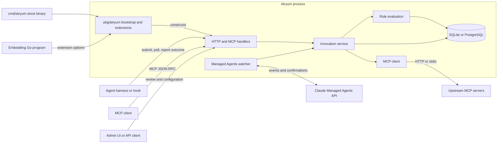
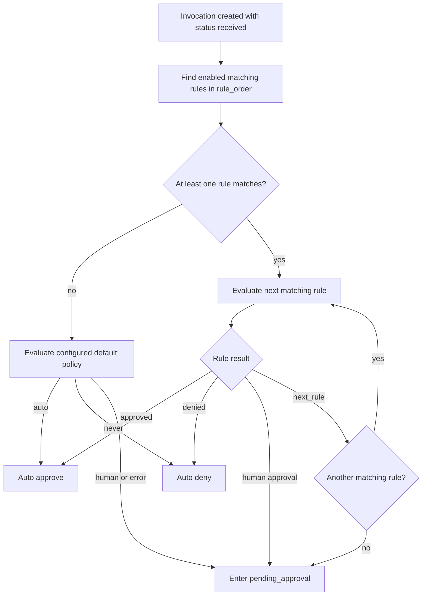
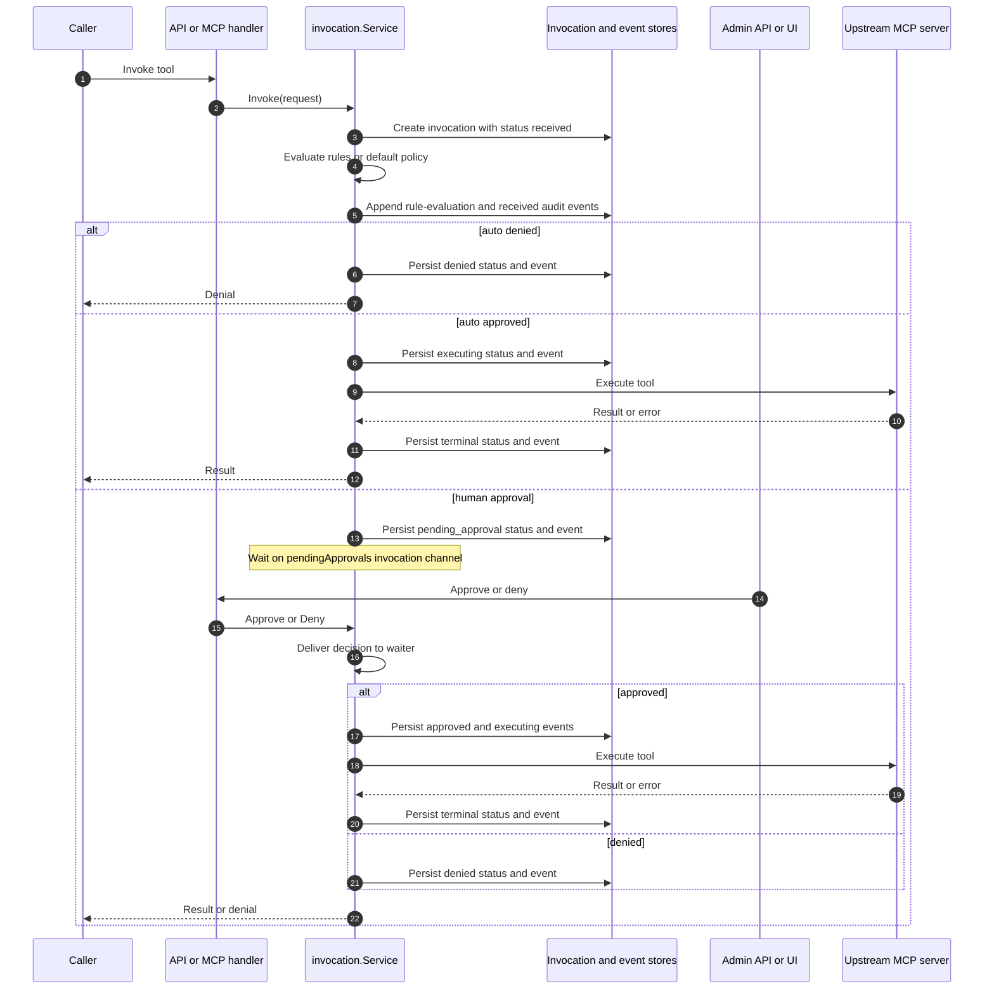
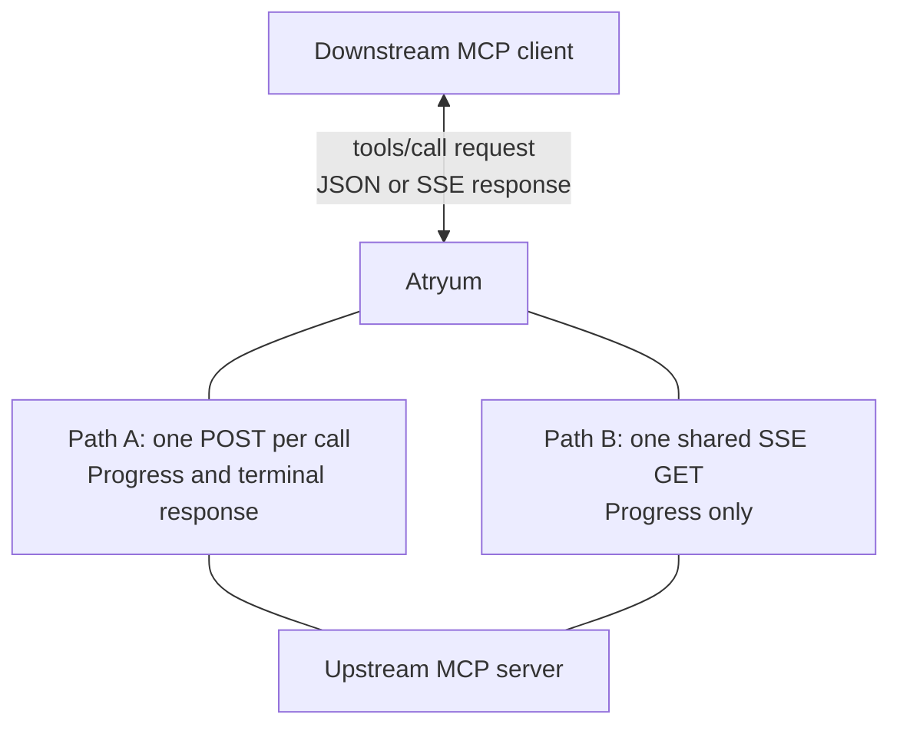
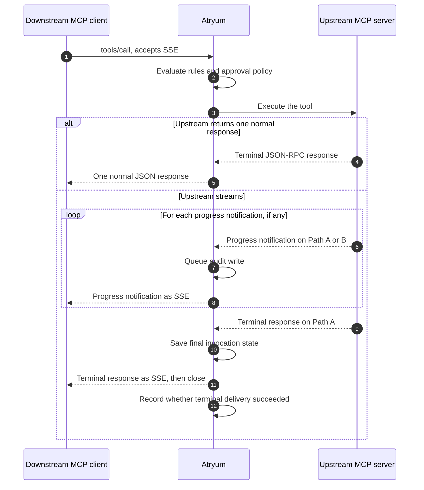
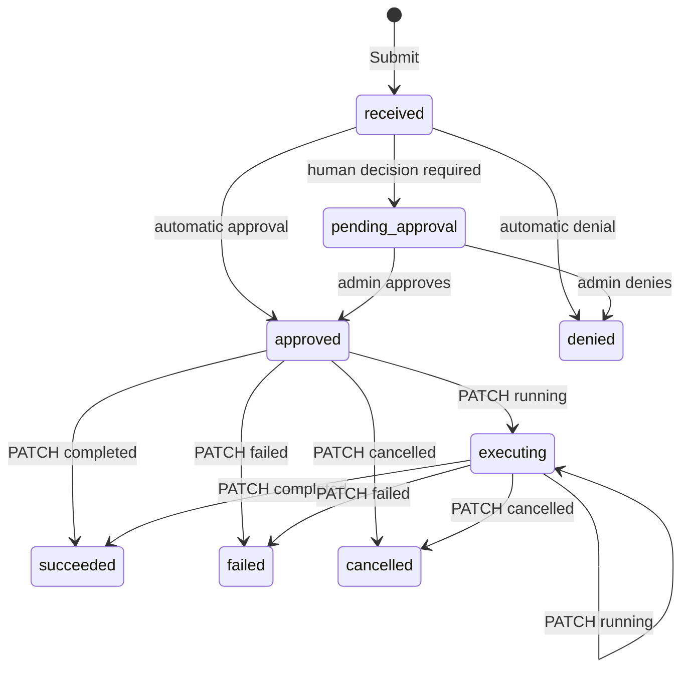
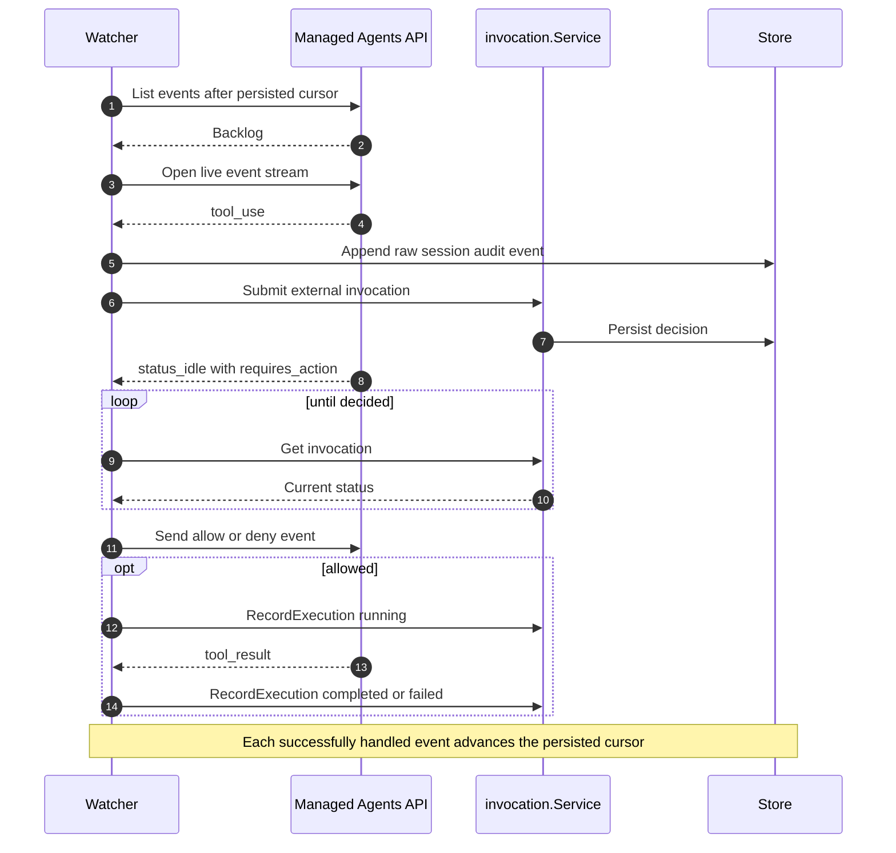

# Atryum architecture

This document describes Atryum's internal boundaries, control flow, and durable state.
For installation, configuration examples, endpoint details, and operator workflows, see
the [README](../README.md).

## System context

Atryum is a Go service that mediates tool calls. It exposes runtime endpoints to agent
harnesses, an MCP-compatible proxy, and an admin API/UI. All ingress paths share the
same invocation service, rule evaluation, and audit store. The stock binary and programs
that embed Atryum both enter through the public `pkg/atryum` bootstrap package.



The diagram corresponds to `cmd/atryum`, `pkg/atryum`, `pkg/migrations`,
`internal/api`, `internal/managedagents`, `internal/invocation`, `internal/store`, and
`internal/mcp`.

## Runtime ingress

The entry path determines who executes an approved tool. It does not change how rules
or audit records are evaluated.

| Path | Service operation | Executor | Completion source |
|---|---|---|---|
| Pre-tool hook: `POST /api/v1/external/invocations` | `Submit` | Calling harness | Harness reports through `PATCH /api/v1/external/invocations/{id}` |
| MCP proxy: `tools/call` on `/mcp/{server}` | `Invoke` | Atryum | Atryum records the upstream MCP result |
| Direct invocation: `POST /api/v1/invocations` | `Invoke` | Atryum | Atryum records the upstream MCP result |
| Managed Agents bridge | `Submit` and `RecordExecution` | Anthropic runtime | Watcher maps Anthropic events to invocation updates |

`Submit` intentionally leaves `upstream_name` empty because it makes a decision only.
`Invoke` resolves a configured MCP server before evaluating and executing the call.

## Component boundaries

| Package | Responsibility | Must not own |
|---|---|---|
| `cmd/atryum` | Thin stock executable that supplies bundled notices and calls `pkg/atryum` | CLI, server, or business logic |
| `pkg/atryum` | Public CLI/server bootstrap and extension options for routes, migrations, database hooks, and notices | Invocation decisions or transport internals |
| `pkg/migrations` | Portable definitions for Atryum's built-in schema migrations | Repository queries or migration execution state |
| `internal/api` | HTTP/MCP transport, authentication middleware, request/response mapping, embedded UI | Rule or invocation state transitions |
| `internal/invocation` | Invocation lifecycle, rule matching, AI evaluation dispatch, approval coordination | SQL or upstream transport details |
| `internal/store` | SQLite/PostgreSQL repositories, migration execution and tracking, durable query semantics | Policy decisions |
| `internal/mcp` | Server resolution, MCP forwarding, upstream authentication and OAuth | Approval policy |
| `internal/auth` | Inbound OIDC/JWT validation and authenticated identity context | Upstream MCP credentials |
| `internal/managedagents` | Anthropic session discovery, event replay, confirmation delivery | Independent rule evaluation |

The React application in `ui/` is compiled into `internal/api/web/` for the production
binary. During development it can run separately, but it still uses the same admin API.

### Embedding and extension boundary

`cmd/atryum` is only the stock executable. The reusable application lives in
`pkg/atryum`, so another Go program can start the same server with additional options:

- `WithRoutes` mounts extra HTTP routes after built-in routes. These routes are outside
  Atryum's authentication middleware and must provide their own authentication.
- `WithMigrations` registers extension-owned, namespaced schema migrations. They run
  after all built-in migrations and are tracked separately by namespace and version.
- `WithDatabase` runs a hook after built-in and extension migrations finish but before
  the server starts accepting requests.
- `WithThirdPartyNotices` replaces the notices text printed by the `licenses` command.

Extensions execute inside the Atryum process and share its database and HTTP server.
They are trusted application code, not isolated plugins. Route patterns must not collide
with built-in routes, and a migration namespace must remain stable across releases.

## Decision pipeline

Rules are loaded in ascending `rule_order`. Matching uses server/source, tool, and the
resolved local agent record. A local agent record is derived from the authenticated
runtime identity; on the no-auth external path, the submitted `agent_id` is used.



`next_rule` is produced only by `ai_evaluation`. If every matching AI rule defers,
Atryum falls back to human approval. The global policy provider is used only when no
rule matches; it is not evaluated after a matching rule defers.

An `ai_evaluation` rule selects one configured evaluator. Standalone deployments use
a local LLM configuration stored in `llm_configs`. Evaluation errors escalate to human
review; missing charter context denies; and an unknown verdict is treated as
`next_rule`, eventually reaching human review if no later rule decides.

## Atryum-executed calls

`Invoke` owns the complete execution lifecycle. A human-gated HTTP request remains
blocked on an in-memory channel until an admin decision or until the caller's request
context is cancelled (a client disconnect or a client-side timeout). Atryum imposes no
approval deadline of its own: the configured `request_timeout_seconds` bounds upstream
tool execution, not the human wait. The durable invocation is still visible while the
request is blocked.

Human-approval coordination for Atryum-executed calls is process-local. PostgreSQL
persists the invocation but does not provide distributed signaling for the in-memory
waiter (the blocked request goroutine), so these calls require a single active Atryum
process. Concretely:

- With multiple replicas, an approval handled by a different process updates the row
  without waking the original request; when that request's context is later cancelled,
  it overwrites the approved state as failed.
- Caller cancellation marks the invocation failed. The stored error text says
  "cancelled", but the persisted status is `failed`, not `cancelled`.
- An abrupt process exit drops the waiter and caller while the durable invocation can
  remain `pending_approval`. Nothing resumes pending invocations at startup, so a
  later approval updates that row but does not execute the tool.

Multi-replica or crash-resumable execution requires durable coordination — for
example a work queue, or an outbox table that a worker drains — which is not
implemented.



The admin invocation stream is a polling SSE view: the handler queries the durable
invocation list every two seconds and emits when its signature changes. Database writes
do not directly publish to the stream.

### Live SSE relay for tools/call

#### Purpose and scope

Atryum normally returns one response after an upstream tool finishes. The live relay
also lets Atryum send progress updates while the tool is still running.

This behavior applies only to `tools/call` requests sent through the MCP proxy at
`/mcp/{server}`. It does not apply to the direct REST endpoint
`POST /api/v1/invocations`.

Streaming is opt-in and keeps the old behavior as its fallback:

1. The downstream MCP client includes `Accept: text/event-stream` to say it can read
   Server-Sent Events.
2. Atryum calls the upstream MCP server.
3. If the upstream returns a normal JSON response, Atryum returns one normal JSON
   response.
4. If the upstream starts a stream, Atryum relays each progress update and then the
   final result.

#### Terms used in this section

| Term | Meaning here |
|---|---|
| **MCP** | Model Context Protocol, the protocol used to call tools. MCP messages use JSON-RPC. |
| **Downstream MCP client** | The agent or agent harness calling Atryum. “Downstream” means the side receiving Atryum's response. |
| **Atryum** | The relay between the downstream client and the upstream server. |
| **Upstream MCP server** | The tool server that Atryum calls. “Upstream” means the side doing the tool work. |
| **JSON-RPC request** | A message asking for work. It has an `id`, and the response must carry the same `id`. |
| **JSON-RPC notification** | A one-way message such as a progress update. It has a `method` but no `id`, so no reply is expected. |
| **Terminal response** | The final JSON-RPC success or error for the tool call. It is the one result a non-streaming call would return. |
| **Terminal delivery** | The final write from Atryum to the downstream client. It can fail even after the upstream result was saved successfully. |
| **SSE** | Server-Sent Events, a one-way HTTP response format that lets a server send multiple events over one open response. |
| **Progress token** | A string or number used to match progress to a call. The client requests it with `_meta.progressToken`; notifications return it as `params.progressToken`. |
| **MCP session** | A group of requests recognized by the upstream server through one session ID. Atryum shares that upstream session across active calls. |
| **Call-response stream** | The response body of the upstream `tools/call` POST. It belongs to one call. |
| **Standalone stream** | A separate SSE GET connection shared by active calls in one upstream MCP session. Some MCP servers send progress here instead of on the call-response stream. |
| **Stdio upstream** | An MCP server run as a local process. Atryum exchanges messages through the process's standard input and output instead of HTTP. |

An SSE event contains one or more `data:` lines and ends with a blank line. For example:

```
data: {"jsonrpc":"2.0","method":"notifications/progress","params":{"progress":1,"total":3}}

data: {"jsonrpc":"2.0","id":"1","result":{"content":[{"type":"text","text":"done"}]}}
```

The first event is a progress notification. The second event is the terminal response.

#### The two upstream paths

Every HTTP tool call has its own POST response. Some upstream servers put both progress
and the terminal response on that response. Other servers put progress on a separate,
shared GET stream while still returning the terminal response on the POST response.
Atryum listens to both paths.



| | Path A: call-response stream | Path B: standalone stream |
|---|---|---|
| HTTP connection | The response to one `tools/call` POST | One SSE GET shared by active calls in an upstream session |
| Carries progress | Yes | Yes |
| Carries the terminal response | Yes | No; the terminal response still arrives on the POST response |
| How an update is matched to a call | The response already belongs to that call | Atryum matches `params.progressToken` |

For a stdio upstream there is no HTTP or SSE on the upstream side. The process sends one
JSON-RPC message per line instead. Atryum applies the same message classification,
timeout, audit, and downstream-relay rules to those messages.

#### Normal call flow



Approval happens before Atryum contacts the upstream server. While waiting for a human
decision, the downstream request remains open but Atryum has not started an SSE
response. A denial stays a normal JSON response. After approval, execution follows the
flow above.

#### Matching shared progress to the correct call

The standalone stream is shared, so receiving an event does not by itself identify the
call that owns it. Atryum uses this process:

1. The downstream client supplies `_meta.progressToken`.
2. Before sending the tool call upstream, Atryum replaces that token with a value unique
   to this call.
3. On the standalone path, Atryum uses its unique value to select the correct call. On
   the call-response path, the HTTP response already identifies the call.
4. Before relaying progress from either path, Atryum restores the client's original token.

Rewriting is necessary because two unrelated clients can choose the same token. Without
it, one client could receive another client's progress.

A standalone notification without a progress token cannot always be matched safely. If
exactly one call is currently using the shared stream, Atryum sends the notification to
that call. If several calls are active, Atryum drops it rather than guess and risk
cross-delivery.

#### Code responsibilities

| Layer | Responsibility for this feature |
|---|---|
| `pkg/atryum` (startup only) | Load stream configuration, inject timeout and audit limits into the invocation service, and set the relay kill switch on the HTTP handler. |
| `internal/api` | Detect downstream SSE support, write and flush SSE frames, send heartbeats, enforce downstream write deadlines, and finish the stream. |
| `internal/invocation` | Preserve rule and approval behavior, update invocation state, and audit stream events through a bounded shared dispatcher. |
| `internal/mcp` | Call the upstream, parse and classify JSON-RPC messages, merge the two upstream paths, correlate progress tokens, reconnect resumable streams, and enforce upstream timeouts. |

After startup wiring, each call crosses the runtime packages in this order:
`internal/api` → `internal/invocation` → `internal/mcp`.

#### Resource limits

A single timeout is not enough for a stream. A long-running tool can be healthy as long
as it continues to send progress. The relay therefore separates setup, inactivity,
total-duration, and message-size limits:

| Limit | Configuration | What it measures |
|---|---|---|
| Header timeout | `stream_header_timeout_seconds` | How long Atryum waits for HTTP session initialization and response headers, or stdio session initialization. |
| Idle timeout | `stream_idle_timeout_seconds` | The longest allowed gap in upstream activity. It resets after every message, and after SSE keepalive/comment lines, so a busy-but-quiet upstream that heartbeats is not cut off. |
| Maximum duration | `stream_max_duration_seconds` | A hard limit for the upstream execution phase, even if progress continues. |
| Message size | `stream_max_message_bytes` | The largest accepted SSE event, stdio JSON-RPC line, or plain JSON response body. The default is 4 MiB. |

The downstream connection has a separate per-write deadline. If the downstream client
disconnects or stops reading, Atryum aborts that call instead of leaving a goroutine
blocked forever. While the upstream is quiet, Atryum sends SSE comment heartbeats so
proxies and load balancers do not mistake the downstream connection for an abandoned
one. The audit trail distinguishes an upstream timeout (`stream_timeout`), a proven
downstream disconnect (`stream_aborted_downstream`, set only when a write to the agent
actually failed), and other transport failures. A bare request-context cancellation is
recorded as `stream_canceled`: with no failed downstream write, a quiet agent
disconnect and a server shutdown are indistinguishable, so the audit does not guess.

#### Reliability guarantees and limits

- **Plain JSON remains the fallback.** Atryum does not start the downstream SSE response
  unless the client accepts SSE and the upstream sends an SSE response or a stdio
  intermediate message.
- **Approval still comes first.** No upstream call or downstream stream starts while a
  tool call is waiting for approval.
- **Retry is safe only before delivery.** Atryum may retry session setup before it has
  relayed anything. After the first relayed event, retrying could duplicate visible
  progress, so Atryum returns a terminal stream error instead.
- **A started stream gets a terminal frame.** If execution fails after streaming has
  begun, Atryum sends a final JSON-RPC error event instead of silently closing the
  connection or trying to change the HTTP status.
- **The per-call upstream stream can resume.** If it closes after providing an SSE event
  ID but before the terminal response, Atryum reconnects with a `Last-Event-ID` header
  naming the last processed event. If the upstream inclusively replays that event,
  Atryum skips the duplicate. Reconnects use bounded exponential backoff with jitter;
  the upstream cannot cause a zero-delay retry loop.
- **The standalone stream reconnects but does not replay.** A transient connection
  failure is retried with backoff. Session renewal opens a new standalone GET carrying
  the new session ID. Because this path has no replay cursor, messages sent while it was
  disconnected may still be missed.
- **The downstream stream does not resume.** Atryum intentionally sends no downstream
  SSE event IDs because it does not store each client's last processed position across
  restarts.
- **Audit storage cannot stall delivery.** Each intermediate event is offered to a
  process-wide bounded, sharded dispatcher served by a fixed worker pool. A call does
  not create its own audit goroutine, and one call's events remain ordered. Slow or
  failed writes are counted in the completion audit row; they do not delay the live
  event.
- **Audit volume is bounded.** `stream_audit_max_events` limits rows per call, and
  `stream_audit_max_event_bytes` limits the retained bytes in each row. Events beyond
  those storage limits are still relayed.
- **A slow call cannot block the shared standalone stream.** Each call has a bounded
  progress buffer. If it fills, Atryum drops that call's standalone progress event so
  other calls can continue. `standalone_events_dropped` in
  `invocation.stream_completed` makes that loss visible.
- **Unsupported standalone GET is not fatal.** If an upstream does not provide this
  optional path, Atryum stops trying while the current group of calls remains active.
  The tool call and its POST response continue normally.
- **Input memory is bounded.** Atryum rejects an upstream message above
  `stream_max_message_bytes` instead of accumulating an arbitrarily large SSE event,
  stdio line, or plain JSON body in memory.
- **Execution and delivery are audited separately.** A durable succeeded/failed
  invocation describes the upstream outcome. `invocation.stream_delivery` separately
  records whether the terminal SSE frame reached the downstream connection. A
  persistence failure is recorded as `persistence_failed`, never as a successful stream.
- **Multi-line SSE data stays valid.** Atryum writes one `data:` field for every payload
  line and terminates the event with a blank line.
- **Upstream requests are not forwarded as notifications.** Server-to-client requests
  such as sampling or elicitation require a response channel Atryum does not broker.
  Atryum audits and drops them instead.
- **The relay has a kill switch.** Setting `stream_relay_enabled = false` restores
  buffered, single-response behavior for every `tools/call`.

#### Advanced implementation notes

These details matter when changing the implementation but are not needed to understand
the normal flow:

- An HTTP response becomes committed when Atryum writes its headers or first bytes.
  Before that point Atryum can still return plain JSON. After that point every success or
  error must be a final SSE frame; the handler cannot switch response formats.
- Heartbeats and tool events can be produced by different Go lightweight threads
  (goroutines). A lock serializes downstream writes so two frames can never be
  interleaved and corrupted.
- Resetting an idle timer races with the timer callback if implemented naively. The
  timeout guard checks the actual elapsed idle time before ending the call.
- A timed-out stdio tool can leave child processes behind. On operating systems that
  support process groups, Atryum terminates the entire group rather than only the direct
  child.

## Decision-only calls

`Submit` persists and returns a decision without contacting an MCP server. An external
executor polls a pending invocation, runs the tool only after approval, and reports its
execution state.



The state diagram shows the supported caller contract, not enforced transitions.
`RecordExecution` currently validates only the transition to `running`; the terminal
reports (`completed`, `failed`, `cancelled`) are applied without checking the prior
status, so callers must not report a terminal outcome before approval. When inbound auth supplies an agent identity, the service also checks that
the invocation belongs to that agent. In no-auth mode, ownership cannot be verified.

## Managed Agents bridge

Each configured account can run watchers for linked Anthropic sessions. A watcher
replays events from its persisted cursor, follows the live SSE stream, and reconnects
after failures. Tool calls still use `Submit`, so this bridge does not introduce a
second policy engine.



Tool-use submission is idempotent across replay because the Anthropic event ID is used
as the invocation idempotency key. Cursor advancement waits until the event handler has
completed successfully enough to avoid skipping a confirmation that must be retried.

## Durable model

The core tables are:

| Table | Architectural role |
|---|---|
| `invocations` | Current state and request/result material for each governed call |
| `invocation_events` | Ordered, best-effort event history for an invocation |
| `approval_rules` | Ordered match criteria and decision action |
| `agents` | Mapping from runtime identities to named governance records |
| `mcp_servers` | Runtime upstream definitions and connection state |
| `oauth_credentials` and `oauth_connect_sessions` | Upstream OAuth credentials and browser-flow state |
| `llm_configs` | Local AI-evaluation providers |
| `managed_agent_bindings`, `managed_agent_sessions` | Anthropic agent/session ownership and replay state |
| `external_sessions` | Atryum-minted harness sessions linking external invocations for cross-call evaluation context |

Built-in schema definitions are ordered migrations under `pkg/migrations/`.
`internal/store` applies them at startup and records their versions for both SQLite and
PostgreSQL. Embedding programs can register separately tracked, namespaced migrations
through `pkg/atryum.WithMigrations`; these run after all built-in migrations.

An invocation's row is the authoritative record of current state;
`invocation_events` is best-effort event history. The two writes are separate
statements, not one transaction, so parity can fail in either direction: a status
update can commit while its event append fails, and — where code appends the event
before updating the row — an event can exist for a status update that never
committed. Event-append errors are currently discarded without a log line. Code that
adds a transition must attempt to update both representations, but consumers must not
reconstruct current state solely from events or assume complete parity. Deployments
that require a transactionally complete compliance audit need to wrap both writes in
one transaction (or adopt an outbox design) before treating the event history as
such.

## Configuration and ownership

`atryum.toml` owns process bootstrap concerns: listening, database selection, inbound
auth, optional external service credentials, default policy, and initial upstreams.
After the first successful bootstrap, MCP server definitions, rules, agents, evaluator
settings, and connection state are database-owned and managed through the admin API.

This separation prevents runtime changes from being overwritten by a restart. In
particular, `[[upstreams]]` seeds an empty `mcp_servers` table; it is not continuous
configuration reconciliation.

## Authentication boundaries

Inbound and upstream authentication are separate trust boundaries:

- Agent runtime auth validates bearer tokens and places the configured agent identity
  claim in request context. The invocation service uses that trusted identity for rule
  targeting and ownership checks.
- Admin auth protects the UI and admin API when an auth provider has
  `admin_enabled = true` and the configured admin claim is present.
- Upstream MCP authentication is owned by `internal/mcp/auth_provider`; credentials and
  OAuth tokens are never returned to the agent caller.
- Routes registered through `pkg/atryum.WithRoutes` are deliberately outside Atryum's
  built-in authentication middleware. The embedding program must authenticate and
  authorize those routes itself.
- No-auth mode is a local deployment option. Identity supplied by a caller in this mode
  is attribution, not a cryptographic ownership guarantee.
