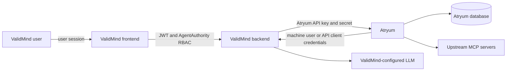
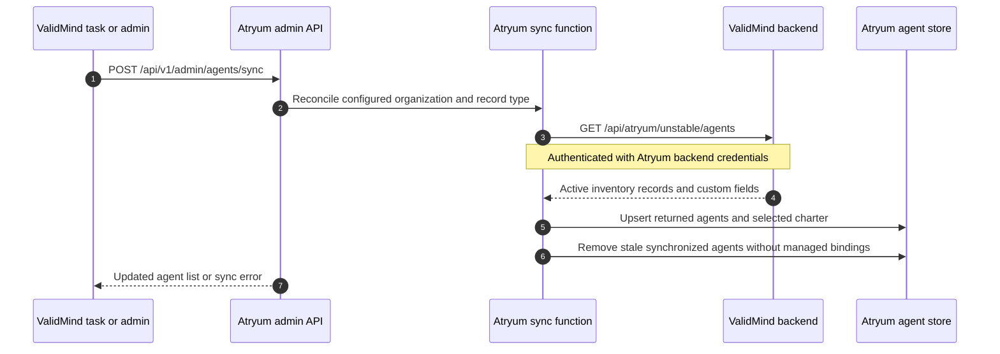
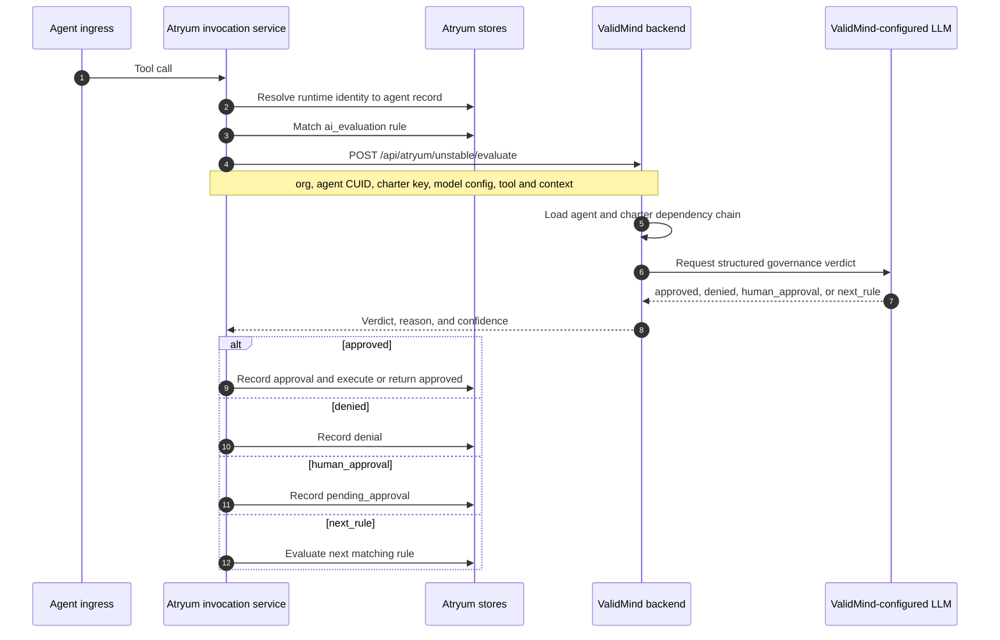
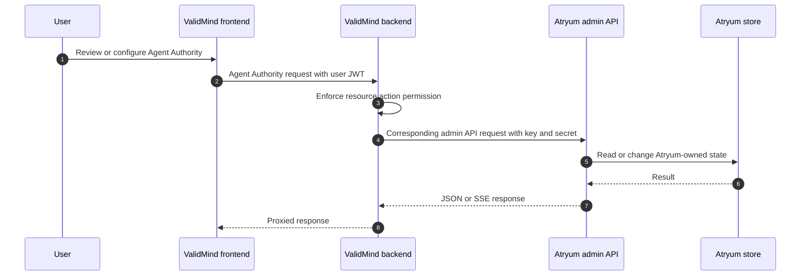

# ValidMind integration

This document covers only the optional integration between Atryum and the ValidMind
platform. Standalone Atryum architecture is described in
[ARCHITECTURE.md](ARCHITECTURE.md); installation and general operation remain in the
[README](../README.md).

The integration is bidirectional:

- ValidMind calls Atryum to administer Agent Authority and read invocation data.
- Atryum calls ValidMind to discover inventory-backed agents and model configurations,
  evaluate tool calls against charters, and summarize invocations.

## Topology and trust boundaries



| Direction | Authentication | Purpose |
|---|---|---|
| Browser to ValidMind backend | User JWT plus ValidMind `AgentAuthority` RBAC | Platform UI access and review permissions |
| ValidMind backend to Atryum | Atryum `X-API-Key` and `X-API-Secret` | Admin proxy, sync trigger, and reporting calls |
| Atryum to ValidMind backend | `X-MACHINE-KEY` and `X-MACHINE-SECRET`, or the supported API-client key pair | Connection check, inventory discovery, evaluation, and summaries |
| Atryum to upstream MCP server | Server-specific bearer token, headers, OAuth, or stdio environment | Tool execution; unrelated to ValidMind credentials |

These credentials are independent. A ValidMind browser token is not forwarded to
Atryum, and Atryum's upstream MCP credentials are not exposed to ValidMind clients.

## Atryum configuration boundary

The outbound ValidMind client is enabled by the `[backend]` block:

```toml
[backend]
base_url = "https://validmind.example"
machine_key = "..."
machine_secret = "..."
connection_timeout_seconds = 5
evaluate_timeout_seconds = 120
```

`api_key` and `api_secret` may be used instead of the machine-user pair. If both
complete pairs are present, `internal/backend.Client` gives the machine-user pair
precedence. A partial pair in the selected mode is rejected.

Environment overrides are `VM_BASE_URL`, `VM_MACHINE_KEY`, `VM_MACHINE_SECRET`,
`VM_API_KEY`, `VM_API_SECRET`, `VM_CONNECTION_TIMEOUT_SECONDS`, and
`VM_EVALUATE_TIMEOUT_SECONDS`.

When `base_url` is empty, standalone operation does not create the ValidMind client.
When it is set, Atryum verifies the connection during startup. The backend client has
separate normal-request and evaluation HTTP timeouts; `runAIEvaluation` also bounds a
ValidMind evaluation with a 60-second context.

The database-owned `agent_sync_settings` row selects:

- ValidMind organization;
- primary record type used as an agent inventory;
- custom-field key containing the charter;
- optional ValidMind model configuration for summaries; and
- optional default agent record for calls whose runtime identity is not mapped.

Saving sync settings can trigger immediate reconciliation. These values are managed by
the admin API/UI rather than the TOML bootstrap file.

## Agent inventory synchronization

ValidMind inventory records are represented locally in the `agents` table. Atryum
stores the ValidMind CUID and organization metadata, the selected charter value, and
the runtime `agent_ids` used for rule targeting. ValidMind remains the source of truth
for synchronized inventory metadata; runtime identity mappings are Atryum governance
data.



The same sync function is used at startup when sync settings are complete and when
settings are saved. A ValidMind-side task may call the admin sync endpoint after
inventory changes; Atryum does not depend on that task for eventual recovery because a
later startup or manual sync reconciles the full configured set.

## Charter-backed AI evaluation

An `ai_evaluation` rule with `model_config_cuid` selects the ValidMind evaluator. The
local LLM branch, selected with `atryum_llm_config_id`, is not part of this integration.
The rule API enforces that exactly one evaluator is configured.



The request contract is defined by `backend.EvaluateRequest` and includes the selected
organization, agent record, charter field, model configuration, tool identity,
arguments, and bounded session context. The response vocabulary is normalized into the
same internal dispositions used by local evaluation.

If the runtime identity does not resolve to a synced agent, Atryum may use the
configured default ValidMind agent. Missing agent or charter context denies the call;
an unavailable evaluator or backend error escalates to human review. An unknown
verdict is treated as `next_rule`, so a later matching rule may decide it; if none does,
the invocation enters human review.

## Admin proxy

In the integrated deployment, the ValidMind frontend does not call Atryum directly.
The ValidMind backend applies user authentication and `AgentAuthority` authorization,
then proxies allowed requests to Atryum with its service credentials.



Invocation streaming follows the same boundary: the ValidMind backend proxies Atryum's
admin SSE response. Approval and denial requests travel back through the ordinary admin
proxy and use Atryum's invocation service.

## Ownership of data

| Data | System of record |
|---|---|
| Inventory record identity, organization, and charter custom field | ValidMind |
| Runtime agent ID mappings and enabled state | Atryum |
| Approval rules and evaluator selection | Atryum |
| Invocation current state and audit events | Atryum |
| ValidMind model configurations and charter dependency graph | ValidMind |
| Upstream MCP credentials and OAuth tokens | Atryum |

This boundary is important during failure recovery: ValidMind inventory can be
re-synchronized, but Atryum invocation and audit state must not be reconstructed from
the platform proxy.

## Failure behavior

- Atryum startup fails when a configured ValidMind backend cannot pass its connection
  check. With no backend configured, the standalone service starts normally.
- Agent synchronization is a full reconciliation. A failed sync leaves the prior local
  data available and can be retried.
- Evaluation has a dedicated client timeout because it includes an LLM call, plus the
  invocation service's 60-second context bound.
- Backend failures escalate to human review, missing charter data denies, and unknown
  verdicts continue rule evaluation rather than being interpreted as approval.
- Failure of the ValidMind admin proxy does not change Atryum's durable invocation
  state; operators can diagnose the Atryum API and ValidMind proxy independently.

## Source map

The Atryum side of the contract is implemented in:

- `internal/backend/client.go`: ValidMind HTTP client and request/response contracts;
- `cmd/atryum/main.go`: startup connection check and shared sync function;
- `internal/api/handlers.go`: settings, agent sync, admin, and reporting endpoints;
- `internal/invocation/service.go`: evaluator selection and verdict handling;
- `internal/store/agent_sync_settings.go` and `internal/store/agents.go`: local
  integration state.

The platform-side implementation lives in the separate ValidMind backend and frontend
repositories. Cross-repository changes must verify both sides of the HTTP contract;
paths or UI modules in those repositories are intentionally not duplicated here.
