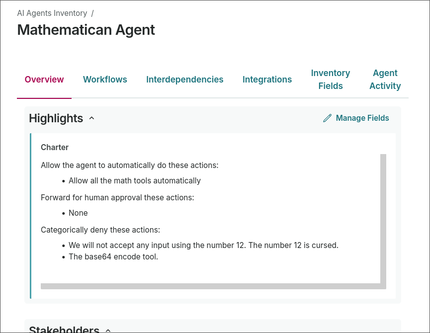

# Atryum quickstart

Install and initialize Atryum, then integrate Atryum with your coding agents and ValidMind.

## Install & initialize Atryum

### Download Atryum

**Linux**

```bash
curl -L https://github.com/validmind/atryum/releases/download/0.0.2/atryum-linux -o atryum && chmod +x atryum
```

**macOS**

```bash
curl -L https://github.com/validmind/atryum/releases/download/0.0.2/atryum-mac -o atryum && chmod +x atryum
```

### Set up Atryum test server

1. Generate a minimal testing configuration with a simple calculator Model Context Protocol (MCP) server that does not require any external credentials:

    ```bash
    ./atryum setup demo
    ```

2. Start the Atryum service and register the test calculator server in Atryum's local database:

    ```bash
    ./atryum run --init-servers
    ```

3. In your browser, navigate to [`localhost:8080`](http://localhost:8080) to open the Atryum local web user interface. Here, you can view servers, tool calls, approvals, and rules.

4. Confirm that Atryum registered the calculator server:

    - Click **Servers** in the left navigation, and confirm that the calc server appears without errors.
    - Atryum exposes this server at [`localhost:8080/mcp/calc`](http://localhost:8080/mcp/calc).

5. Connect your coding agent to Atryum. Open your agent's MCP settings and add a standard MCP server with the calc server address: `localhost:8080/mcp/calc`.

    The agent will think it is talking to a calculator MCP server, but its tool calls now pass through Atryum first.

6. Trigger a test tool call from your agent. For example:

    ```text
    Use the calculator tools and show me 2*2
    ```

7. Within Atryum, you should see the calculator invocation:

    - By default, it should be pending human approval.
    - Approve it to let the tool call run.

### Set up rules for Atryum

Rules are if/then policies that tell Atryum how to handle tool calls. Rules let you reuse manual decisions for future tool calls that match the same conditions. For example — if the server is `calc`, then approve the call automatically.

Add a rule to control future matching tool calls:

1. In Atryum, click **Rules** in the left navigation.

2. Click **New Rule**.

3. Choose an action:
    - **Auto Approve** lets matching tool calls run without stopping for manual approval.
    - **Auto Deny** blocks matching tool calls automatically.
    - **Human Approval** pauses matching tool calls until a human approves or denies them.

4. Choose the servers, tools, or agents the rule should apply to. For this demo, choose the `calc` server if you want the rule to apply only to calculator calls.

5. (Optional) Add a description so you can remember why the rule exists.

6. Click **Create**.

7. Try the calculator prompt again. Atryum should apply the new rule instead of treating the call like a brand-new manual decision.

- Rules are applied from top to bottom — the first matching rule wins.
- You can also create a rule from an existing invocation by opening the invocation and clicking **Create Rule From This**.
- As a human, you can deny a tool call with a message — which is returned to the agent so you can steer what it does next.

## Integrate Atryum

### With coding agents

Coding agents can be connected to atryum at the harness level. Hooks and extensions are available for Claude Code, Cursor, Amp, Pi, and Codex.

Run

```
./atryum hooks
```

### With ValidMind

To connect your atryum to ValidMind run:

```
./atryum setup validmind
ValidMind Base URL: (you probably want dev)
ValidMind API key: abcd1234
ValidMind API secret: arstarst
updated ValidMind credentials in $HOME/.config/atryum/atryum.toml
```

Once setup, restart and return to the UI:

[`localhost:8080/settings`](http://localhost:8080/settings)

Fill out the form. It is helpful to have the following setup in ValidMind:

- A primary record type specifically for ai-agents.
- A long text field on that record for agent charters.

The charter is where you define "allowed to do X", "deny the agent trying to do Y", and "pass requests to do Z for human approval".



Since this is a quick demo, set the default agent in the settings page. We'll connect with agent identity later.

Finally you need a rule, relatively high in priority, mapping that default Agent Record to AI Evaluation.

With all that setup, you're ready to rock and roll. Ask the agent to do work, then use the charter in ValidMind to restrict its scope.
